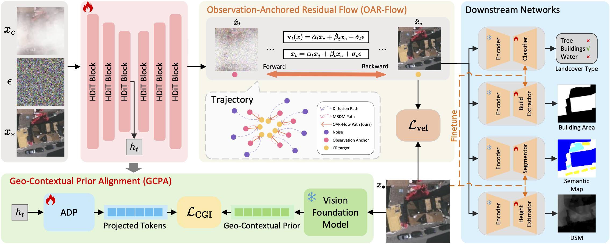

# Interpretation-Oriented Cloud Removal via Observation-Anchored Residual Flow with Geo-Contextual Alignment

Official implementation of **"Interpretation-Oriented Cloud Removal via Observation-Anchored Residual Flow with Geo-Contextual Alignment"**, accepted by **ECCV 2026**.

Paper (coming soon) | [Code](https://github.com/wzy6055/GACR)



## Updates

- June 2026: Source code has been released!
- June 2026: GACR was accepted into ECCV 2026. Congratulations! 🥳

## Overview

This repository provides the training and testing code for GACR, an interpretation-oriented cloud removal framework built around:

- **OAR-Flow**: Observation-Anchored Residual Flow for cloud-removal flow matching.
- **GCPA**: Geo-Contextual Prior Alignment using visual foundation model features.

## Install

We provide a tested environment list in `requirements.txt`. To set up this environment, first create and activate a conda environment:

```bash
conda create -n gacr python=3.10 -y
conda activate gacr
```

Then install the required packages:

```bash
pip install -r requirements.txt
```

Please note that `flash-attn` and `natten` are sensitive to CUDA and PyTorch versions. If you encounter dependency conflicts during installation, we recommend referring to the setup instructions of [EMRDM](https://github.com/Ly403/EMRDM) and installing these two packages from compatible wheel files.

If you run into other installation issues, please feel free to open an issue.

## Run

### Dataset

CUHKCR-EXT is further developed from the dataset introduced in [DFCFormer](https://github.com/wzy6055/DFCFormer). Compared with the original dataset, We additionally provided building extraction labels. The CR, CLS, and BLD tasks in this work are based on the newly released version. The dataset can be downloaded from [Baidu Netdisk](https://pan.baidu.com/s/1Qzg855PVPbflMUqQL6YDTQ?pwd=gacr) with access code `gacr`.

Potsdam-CR and Vaihingen-CR are synthetic cloud-removal datasets built from the [ISPRS Potsdam](https://www.isprs.org/resources/datasets/benchmarks/UrbanSemLab/2d-sem-label-potsdam.aspx) and [ISPRS Vaihingen](https://www.isprs.org/resources/datasets/benchmarks/UrbanSemLab/2d-sem-label-vaihingen.aspx) datasets using [Satellite Cloud Generator](https://github.com/strath-ai/SatelliteCloudGenerator). The data and splits used for the CR SEG, and HE tasks in this work are available from the following links:

- Potsdam-CR: [Baidu Netdisk](https://pan.baidu.com/s/1g1d8eXaN0thRdi9ZX1DoSQ?pwd=gacr), access code `gacr`
- Vaihingen-CR: [Baidu Netdisk](https://pan.baidu.com/s/1hd5EqA_vhBBhTagY0SNMnw?pwd=gacr), access code `gacr`

### Prepare VFM Weights

Our implementation has been tested with the following visual foundation models:

- DINOv3 (ViT-L) ([url](https://github.com/facebookresearch/dinov3))
- DINOv2 (ViT-L) ([url](https://github.com/facebookresearch/dinov2))
- CLIP (ViT-L) ([url](https://github.com/openai/CLIP))
- MAE (ViT-L) ([url](https://github.com/facebookresearch/mae))

Place the model weights under `vfm_weights/`, or update the corresponding paths in your config file.

In our implementation, DINOv3 uses `.pth` weights, while DINOv2, MAE, and CLIP are loaded from Hugging Face-style safetensors.

An example DINOv3 weight layout is:

```text
vfm_weights/
  dinov3/
    dinov3_vitl16_pretrain_lvd1689m-8aa4cbdd.pth
```

For DINOv2, MAE, and CLIP, use Hugging Face model directories, for example:

```text
vfm_weights/
  dinov2-large/
  vit-mae-large/
  clip-vit-large-patch14/
```

### Train

The released code supports both offline GCPA and online GCPA.

(1) For offline GCPA, which has currently been tested with DINOv3, first cache the features as a `.npy` file:

```bash
python cache_feat.py \
  --data-path /path/to/DATA_ROOT/clear \
  --output-path ./dataset_dino_v3/YOUR_DATASET/dinov3_lvd.npy \
  --source local \
  --repo-path /path/to/dinov3_repo \
  --weight-path ./vfm_weights/dinov3/dinov3_vitl16_pretrain_lvd1689m-8aa4cbdd.pth
```

Then set the dataset path and cached feature path in the config file:

```yaml
gcpa:
  vfm: "dinov3"
  offline: true
  feat_path: "./dataset_dino_v3/YOUR_DATASET/dinov3_lvd.npy"
```

(2) For online GCPA, set `offline` to `false` and configure the VFM weight path in the config file. For example, online DINOv3 can be configured as:

```yaml
gcpa:
  vfm: "dinov3"
  offline: false
  model_path: "./vfm_weights/dinov3/dinov3_vitl16_pretrain_lvd1689m-8aa4cbdd.pth"
  source: "local"
  repo_path: "/path/to/dinov3_repo"
  model_name: "dinov3_vitl16"
```

For Hugging Face-style VFMs such as DINOv2, MAE, and CLIP, use:

```yaml
gcpa:
  vfm: "clip"  # or "dinov2" / "mae"
  offline: false
  model_path: "./vfm_weights/clip-vit-large-patch14"
  local_files_only: true
```

(3) Then launch training with:

```bash
accelerate launch train.py --config config/changsha.yaml
```

The training outputs will be saved to `exps/<exp_name>/`:

### Test

You can evaluate a trained checkpoint with:

```bash
python test.py \
  --config config/changsha.yaml \
  --ckpt exps/<exp_name>/checkpoints/0200000.pt \
  --num-steps 4
```

To explicitly save the predicted cloud-free images, run:

```bash
python test.py \
  --config config/changsha.yaml \
  --ckpt exps/<exp_name>/checkpoints/0200000.pt \
  --num-steps 4 \
  --save-pred
```

## Acknowledgment

This codebase is built upon several excellent open-source projects. We sincerely thank the authors and maintainers for their contributions to the community:

- [EMRDM](https://github.com/Ly403/EMRDM)
- [k-diffusion](https://github.com/crowsonkb/k-diffusion)
- [REPA](https://github.com/sihyun-yu/REPA)
- [SiT](https://github.com/willisma/sit)
- [DFCFormer](https://github.com/wzy6055/DFCFormer)

## Citation

If you find our work useful, please consider citing our paper. (The page numbers will be added once available.)

```bibtex
@inproceedings{wang2026gacr,
  title={Interpretation-Oriented Cloud Removal via Observation-Anchored Residual Flow with Geo-Contextual Alignment},
  author={Wang, Ziyao and Wang, Maonan and He, Yucheng and Ma, Xianping and Wang, Ziyi and Zhang, Hongyang and Cheng, Yirong and Pun, Man-On},
  booktitle={European Conference on Computer Vision},
  year={2026},
  publisher={Springer},
}
```
